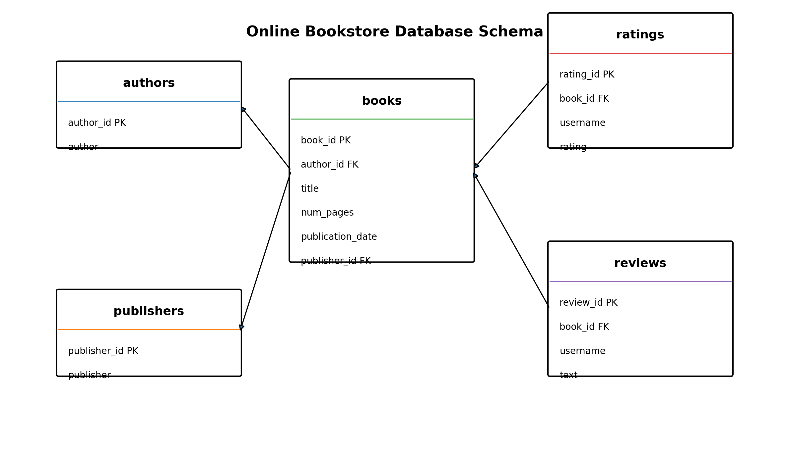

# SQL Bookstore Analysis

## Project Overview

This project analyzes a relational database from an online bookstore using SQL. The goal is to answer business questions about the book catalog, authors, publishers, user ratings, and written reviews.

The analysis was developed as part of the TripleTen Data Analysis Bootcamp and focuses on extracting insights from a PostgreSQL database.

## Business Context

The growth of digital reading services created opportunities for new products in the book market. To support product strategy, this project explores data from a competing book service and identifies patterns related to catalog composition and reader engagement.

## Objectives

- Explore the structure of a relational database.
- Analyze books, authors, publishers, ratings, and reviews.
- Answer business questions using SQL queries.
- Identify relevant patterns in publication trends and user engagement.
- Communicate findings clearly for business decision-making.

## Database Schema

The database contains five main tables:

| Table | Description |
|---|---|
| `books` | Book information, including title, pages, publication date, author, and publisher |
| `authors` | Author names and IDs |
| `publishers` | Publisher names and IDs |
| `ratings` | Numeric ratings submitted by users |
| `reviews` | Text reviews written by users |

Relationships:

```text
books.author_id     -> authors.author_id
books.publisher_id  -> publishers.publisher_id
ratings.book_id     -> books.book_id
reviews.book_id     -> books.book_id
```



## Tools and Technologies

- SQL
- PostgreSQL
- Python
- Pandas
- SQLAlchemy
- Jupyter Notebook

## Key Questions and Results

| Question | Result |
|---|---:|
| Number of books published after January 1, 2000 | 819 |
| Most reviewed book | Twilight (Twilight #1), 7 reviews |
| Publisher with the most books over 50 pages | Penguin Books, 42 books |
| Author with the highest average rating, considering books with at least 50 ratings | J.K. Rowling/Mary GrandPré, 4.29 |
| Average number of text reviews among users who rated more than 50 books | 24.33 |

## Main Insights

- 819 out of 1,000 books were published after January 1, 2000, representing 81.9% of the catalog.
- The catalog is strongly concentrated in contemporary publications.
- Penguin Books has the largest presence among books with more than 50 pages.
- Highly rated authors include J.K. Rowling/Mary GrandPré, Markus Zusak/Cao Xuân Việt Khương, and J.R.R. Tolkien.
- Active users tend to submit numeric ratings more often than written reviews.

## Repository Structure

```text
sql-bookstore-analysis/
│
├── README.md
├── queries/
│   └── bookstore_analysis.sql
│
├── notebooks/
│   └── sql_bookstore_analysis.ipynb
│
├── images/
│   └── database_schema.png
│
├── presentation/
│   └── README.md
│
├── requirements.txt
└── .gitignore
```

## Files

- [`queries/bookstore_analysis.sql`](queries/bookstore_analysis.sql): SQL queries used in the analysis.
- [`notebooks/sql_bookstore_analysis.ipynb`](notebooks/sql_bookstore_analysis.ipynb): cleaned notebook version for portfolio use.
- [`presentation/README.md`](presentation/README.md): link to the project presentation.

## Note About Data Access

The original database was provided through the TripleTen educational environment. Raw database credentials and private connection information are not included in this repository.

To run the notebook with your own PostgreSQL database, configure the following environment variables:

```bash
DB_USER=your_user
DB_PASSWORD=your_password
DB_HOST=your_host
DB_PORT=your_port
DB_NAME=your_database
```

## Author

**Javiera Lobos**  
Junior Data Analyst | SQL | Python | Tableau | Nutrition Background
